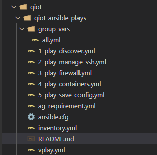

# Playbook to manage the IoT Edge device

There are 5 plays, 1 vars file, 1 vault, 1 inventory :  

Run with ``Ansible 2.10.1``

## I would like to focus on the third plays :

In the QIoT Hackfest have some weaknesses including the security of the edge and so on.  

the Openscap tool enable to scan the device and generate the remediation with, in part, of ansible playbook.  

The target is  to have the same configuration around the world in edge device

/!\ Please take it with caution

### These plays, this repo is in DEVEL MODE, it's an example of playbook to automate the deployment with the minimum security
